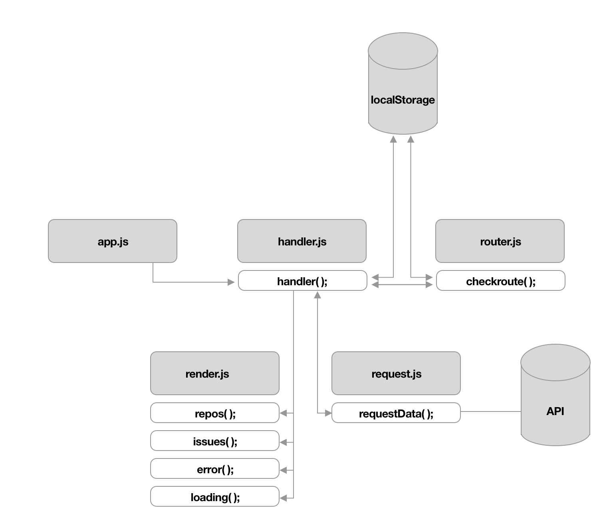
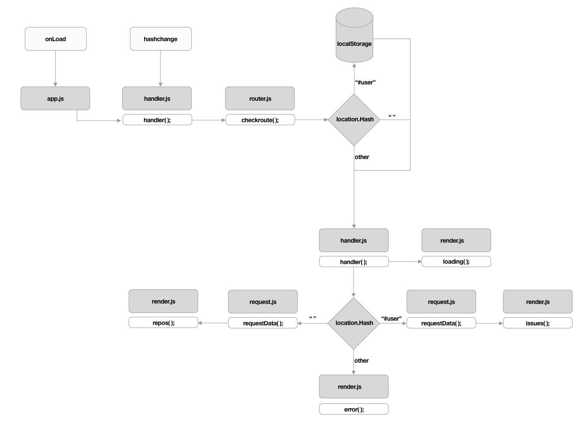

# Think - Draw - Code - Repeat (Plan your code)

Writing structured code is one of the things i would quickly lose when a project got bigger/ more complicated than I expected.
When starting a project the first thing I want to do is dive straight in to code and start building. I’ve learned that that is a good way to write chaotic code that is a mess to clean up later and make clear.
The problem is it is hard to guess how big code is going to get, what is needed and how it needs to be structured, but i’ve learned a few steps that helped me get more structure in my code with 4 steps.

## Think
As much as i love to just dive straight in to a code editor and start writing, it doesn’t work well.
What i’ve found a goof way to think out the flow is to write out what the app does first and than divide that in separate parts which together make up the app.
You could do this by for example making a list of functionalities or writing them on post-its.

## Draw
With the app and functionalities mapped out it’s time to start drawing out your flow.
There are two types of diagrams which i like to use:
#### Actor diagram

The Actor diagram shows in what parts the app can be broken in to, this could mean different functions, components or different files depending on how large your project is and what structure you choose to use.
In this diagram you show how data flows between elements of your app and what kinds of informations is passed on between elements

#### Interaction diagram

The interaction diagram works to show how different functions and elements interact with each other and what the user is taken on

## Code
Here the fun starts, You can finally dive in to the editor and start writing, but keep the plan and diagrams in mind
Keep in mind that the plan and diagrams are more a guideline than a strict planning, sometimes you stumble on a different way to solve a problem or write a function.
While writing the code I keep notes/write comments on what the code does and why for documentation and later reference.

## Repeat
At the end of this cycle it is always good to look back at the plan and expected flow of the app and see what went different and reiterate what the expectations where in comparison to the reality, update the Actor and Interaction diagram and see if parts can be improved on.
I learned that using this flow made it that I had a better overview of my code and that it was clearer for others to get a grasp on what was happening in my code.
